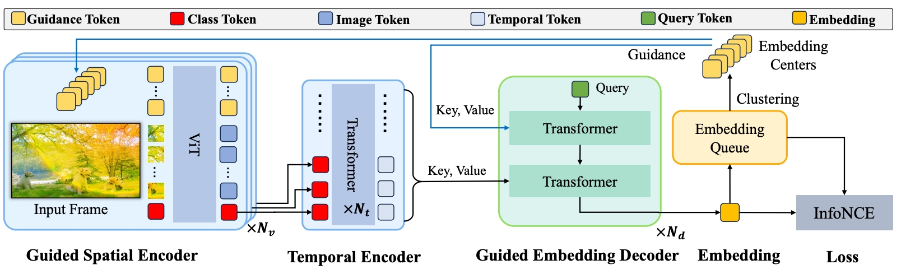

# Edit-3K

Edit3K: Universal Representation Learning for Video Editing Components [[Paper]](https://arxiv.org/pdf/2403.16048) 

Official code for **Edit3K: Universal Representation Learning for Video Editing Components**. <br>

*Xin Gu, Libo Zhang, Fan Chen, Longyin Wen, Yufei Wang, Tiejian Luo, Sijie Zhu*


## Introduction
This paper focuses on understanding the predominant video creation pipeline, i.e., compositional video editing with six main types of editing components, including video effects, animation, transition, filter, sticker, and text. In contrast to existing visual representation learning of visual materials (i.e., images/videos), we aim to learn visual representations of editing actions/components that are generally applied on raw materials. We start by proposing the first large-scale dataset for editing components of video creation, which covers about  editing components with  videos. Each video in our dataset is rendered by various image/video materials with a single editing component, which supports atomic visual understanding of different editing components. It can also benefit several downstream tasks, e.g., editing component recommendation, editing component recognition/retrieval, etc. Existing visual representation methods perform poorly because it is difficult to disentangle the visual appearance of editing components from raw materials. To that end, we benchmark popular alternative solutions and propose a novel method that learns to attend to the appearance of editing components regardless of raw materials. Our method achieves favorable results on editing component retrieval/recognition compared to the alternative solutions. A user study is also conducted to show that our representations cluster visually similar editing components better than other alternatives. Furthermore, our learned representations used to transition recommendation tasks achieve state-of-the-art results on the AutoTransition dataset. 




## Usage

### 1.Install Environment
```bash
pip3 install -r requirements.txt
```


### 2.Download datasets

Download the dataset from Google Drive and extract it to the current directory. 
- [Edit3K]()

### 3. Train & Test

```bash
python3 mm_video/run_net.py \ 
--cfg configs/edit_element.yaml \
TRAINER.TRAINER_BASE.TRAIN_ENABLE True \
TRAINER.TRAINER_BASE.TEST_ENABLE True
```

### 4. Generate embedding
```bash
python3 mm_video/generate_embedding.py
```


## 5. Citation

If our research and this repository are helpful to your work, please cite with:

```
@article{gu2024edit3k,
  title={Edit3K: Universal Representation Learning for Video Editing Components},
  author={Gu, Xin and Zhang, Libo and Chen, Fan and Wen, Longyin and Wang, Yufei and Luo, Tiejian and Zhu, Sijie},
  journal={arXiv preprint arXiv:2403.16048},
  year={2024}
}
```
